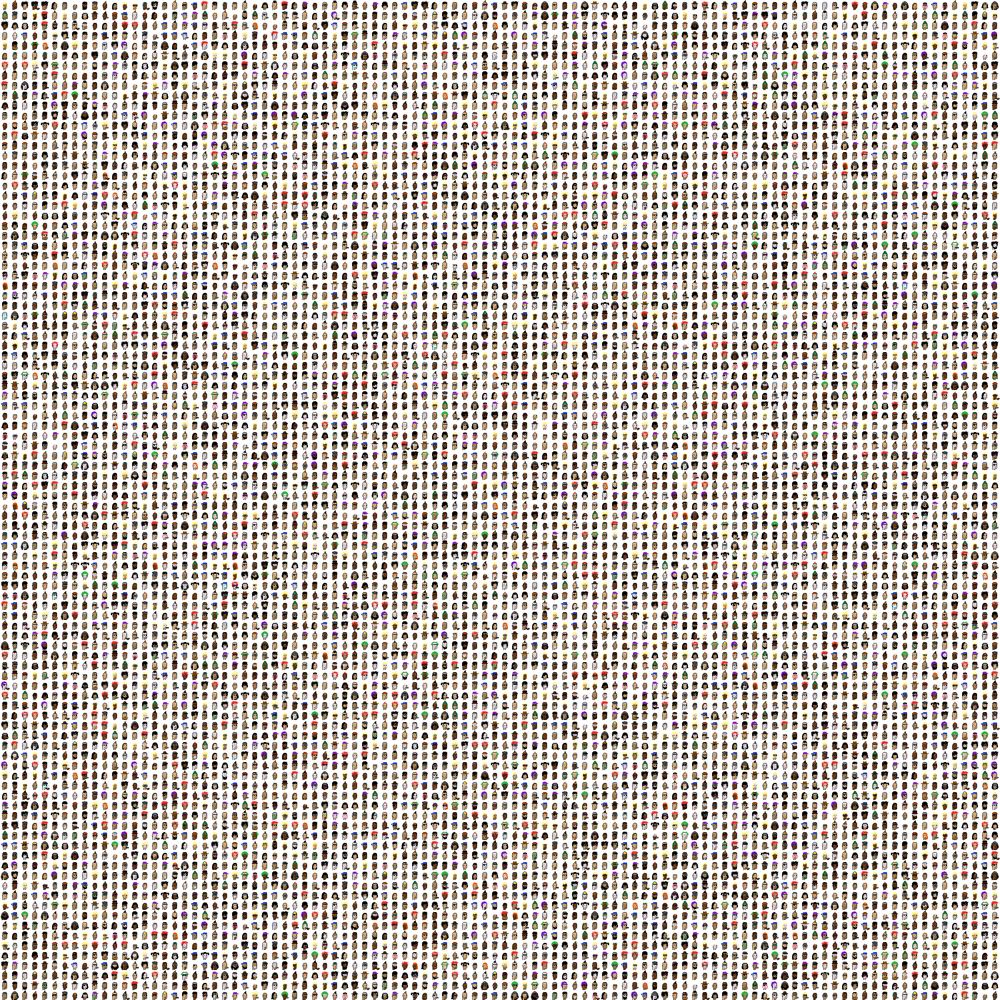

# dead-punks

This script recreates images of all punks in the [CryptoPunks](https://www.larvalabs.com/cryptopunks) project with one pixel corrupted.

Generate all punks separately named `1.png` to `10000.png`:

```
node generate.js
```

Example output of the `generate`:


Generate one image named `0.png` that includes all punks:

```
node generate-all-in-one.js
```

Example output of the `generate-all-in-one`:


